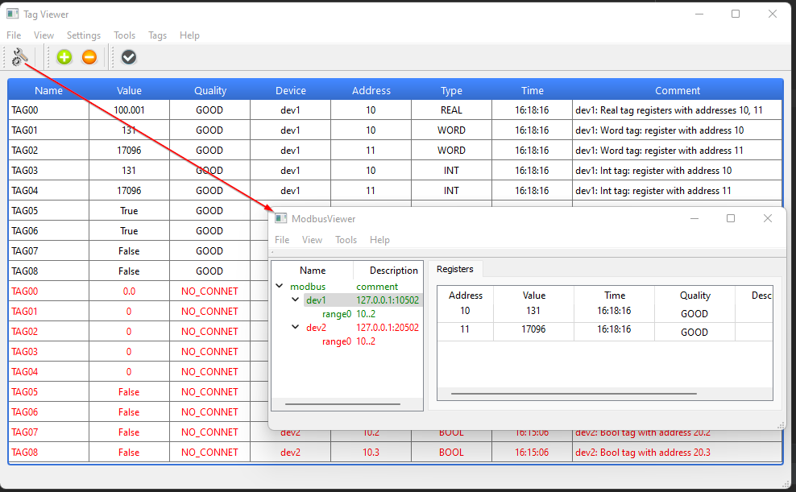
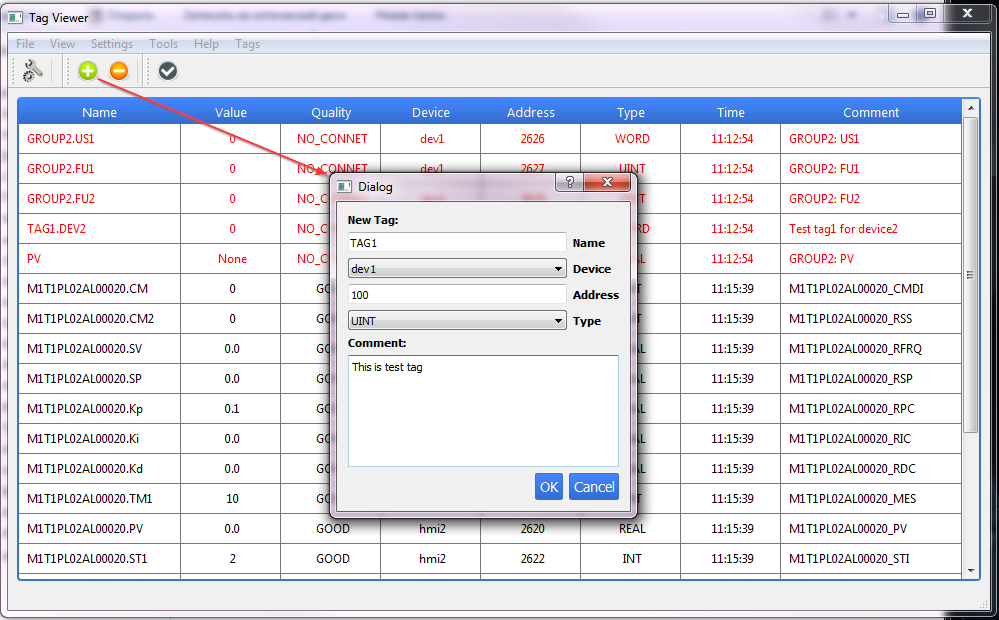

### MDViewer
___

GUI Python application for reading and displaying modbus data from several sources.

Requirements:
- Python 3.6
- PyQt5
- pymodbus
- numpy

Implemented modules:
- Modbus driver (src/drivers/modbus);
- OIServer (src/oiserver);
- JSonServer (src/jsonserver) - not work;
- Pluton (src/pluton) - same graphic for pluton

Tools:
- ModbusViewer - GUI application for observering modbus driver.

___
### How to create virtual environment
**Windows**
~~~bash
$ python -m venv env
$ source env/Scripts/activate
(env)$ python -m pip install --upgrade pip
(env)$ pip install PyQt5 pymodbus numpy pyinstaller
(env)$ deactivate
~~~
**Linux**
~~~bash
$ python3 -m venv env
$ source env/bin/activate
(env)$ python -m pip install --upgrade pip
(env)$ pip install PyQt5 pymodbus numpy pyinstaller
(env)$ deactivate
~~~
___
### Packaging
**Windows**
~~~bash
$ source env/Scripts/activate
(env)$ python setup.py sdist
(env)$ deactivate
~~~
**Linux**
~~~bash
$ source env/bin/activate
(env)$ python setup.py sdist
(env)$ deactivate
~~~
Package **MDViewer-0.1.0.tar.gz** will be found in **dist** directory

___
#### Executable file creation
**Windows** (mdviewer.exe)
~~~bash
$ source env/Scripts/activate
(env)$ pyinstaller --clean --onefile --noconsole --icon=myico.ico --name mdviewer MBTools/main.py
(env)$ deactivate
$ cp -r MBTools/config/ dist/
~~~
**Linux**
~~~bash
$ source env/bin/activate
(env)$ pyinstaller --clean --onefile --noconsole --icon=myico.ico --name mdviewer MBTools/main.py
(env)$ deactivate
$ cp -r MBTools/config/ dist/
~~~
To run application you need to have **config** folder with **conf.json** file wich located near executed file:
~~~
$ tree.exe
.
├── MDViewer-0.1.0.tar.gz
├── config
│   ├── __init__.py
│   ├── conf.json
│   └── qss.css
└── mdviewer.exe
~~~
**conf.json** example:
~~~
{
  "devices": [
    { "name": "hmi2", "protocol": "modbus", "ip": "10.18.32.78", "port": 20502 }
  ],

  "tags": [
    {"name": "M1T1PL02AL00020.PV", "type": "REAL", "device": "hmi2", "address": 2620, "comment" : "M1T1PL02AL00020_PV" }
  ]
}
~~~

---
### How to use
#### Installing requirements and MDViewer package
**Windows**
~~~bash
$ python3 -m venv env
$ source env/bin/activate
(env)$ python -m pip install --upgrade pip
(env)$ pip install PyQt5 pymodbus numpy pyinstaller
(env)$ pip install ../dist/MBTools-0.1.0.tar.gz
(env)$ deactivate
~~~
**Linux**
~~~bash
$ python -m venv env
$ source env/Scripts/activate
(env)$ python -m pip install --upgrade pip
(env)$ pip install PyQt5 pymodbus numpy pyinstaller
(env)$ pip install ../dist/MBTools-0.1.0.tar.gz
(env)$ deactivate
~~~
#### Example of using

~~~python
# -*- coding: utf-8 -*-
import sys
import os

from PyQt5 import QtWidgets, QtCore
from PyQt5.QtWidgets import QApplication

from MBTools.oiserver.OIServer import IOServer
import MBTools.oiserver.tools.OIServerViewer.OIServerViewer as oiv

def main(argv):
    app = QtWidgets.QApplication(sys.argv)

    io = IOServer()
    oiviewer = oiv.OIServerViewer()
    oiviewer.setOiServer(io)
    oiviewer.show()

    return app.exec()

if "__main__" == __name__:
    sys.exit(main(sys.argv))
~~~
